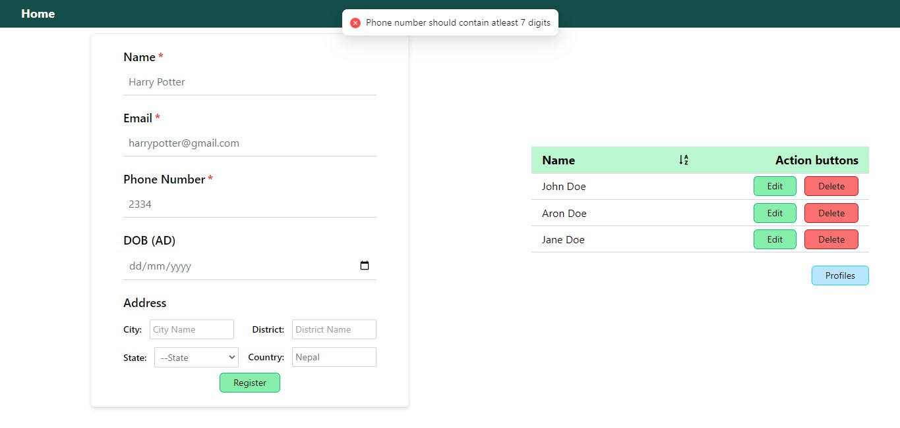
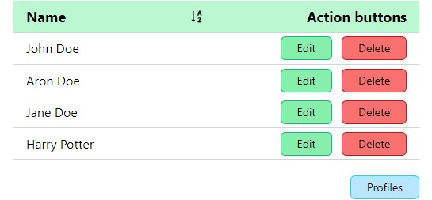
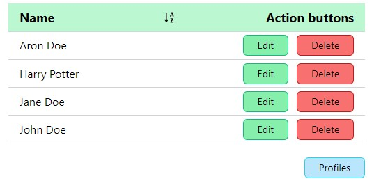
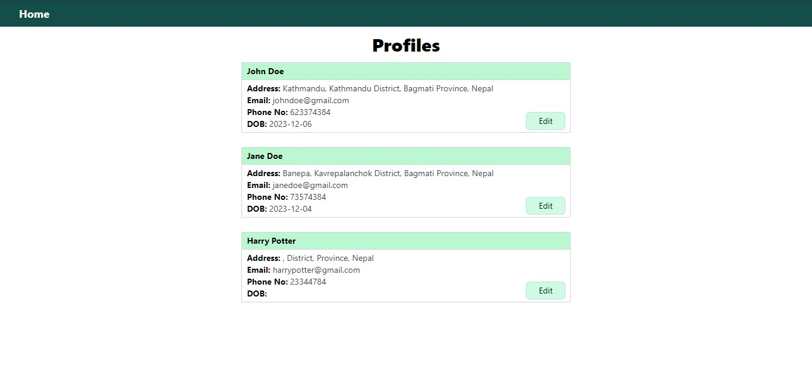
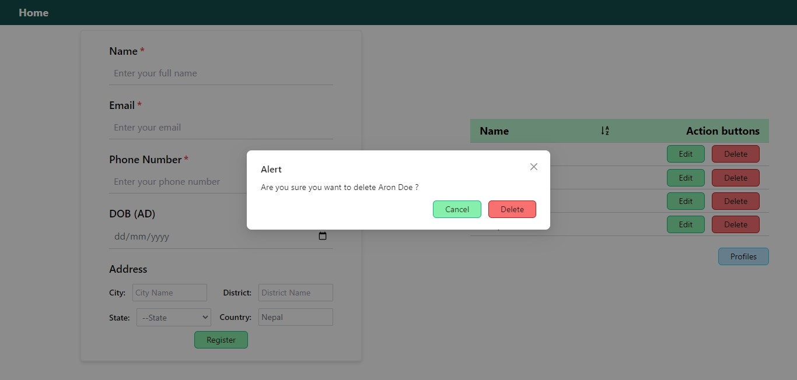

<h1 align="center">
    
</h1>
<h3 align="center">
    <b>React JS Coding Task</b>
</h3>


## About 
<h1></h1>

The ReactJS coding task project consists of a form that allows users to register using their name, email, and phone number. Users can view the created users, edit the information, and delete them as well.

## Key Features 🧑‍💻

- Registering by entering name, email, and phone number. 
- Users can also input their date of birth and address.
- Form validation ensures users cannot register with an empty name, invalid email, or a phone number with less than 7 digits.
- Users can view their records.
- User can edit and delete their information.

## Run Locally (Development Environment) ⚒️

#### Clone the repository and navigate to the project root directory. 
Make sure you have [npm and Node.js](https://docs.npmjs.com/downloading-and-installing-node-js-and-npm) installed on your machine.

```bash
# Get packages
$ npm install
```

```bash
# Run the applicaton
$ npm run dev
```


## Tech Used 💻

- Frontend : React.js
- CSS Framework: Tailwind CSS
- Database : Local storage
- State management : Redux toolkit


## Installed tools and libraries

- Tailwind CSS
- Yup
- Ant Design
- Ant Design Icons
- @reduxjs/toolkit
- uuid

  
## Screenshots 

<div align="center">
  
  <span>
        
        
  </span>
  
  
</div>

